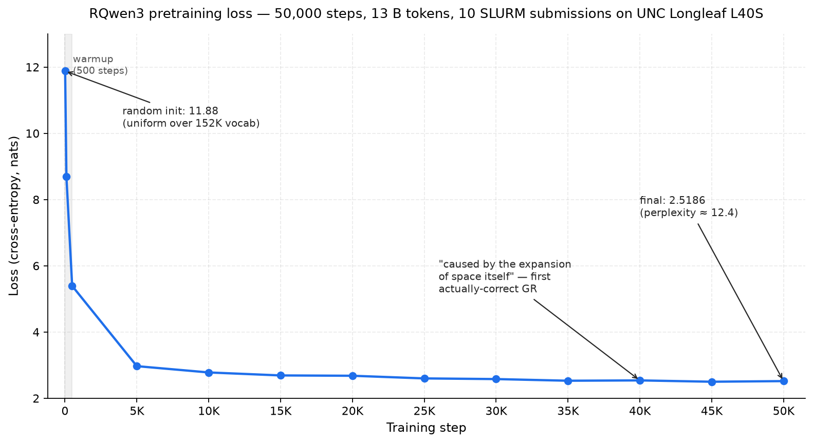

# RQwen3

A 751M-parameter language model built from scratch, architecturally matching Qwen3-0.6B (RoPE, GQA, SwiGLU, RMSNorm, QK-Norm), and pretrained on ~13B tokens of curated educational data on UNC Longleaf. This repo is the full case study: architecture, training pipeline, results, and the bugs along the way.



**Status (2026-06-19):** Pretrain **complete** — 50,000 / 50,000 steps, loss 11.88 → **2.5186** (perplexity ≈ 12.4). Base model at `checkpoints/final.pt`. 10 SLURM submissions over ~11 wall-clock days on UNC Longleaf L40S. Full journey: [docs/pretraining-results.md](docs/pretraining-results.md). Next: held-out val loss, HF Hub weights + model card, and `lm-evaluation-harness` (ARC / HellaSwag / MMLU).

Developed inside a private study monorepo; this repo is the extracted, cleaned public version. Eval and SFT work will accumulate here directly.

## Quick Start

### Local Development

```bash
# From the project root
python -m venv .venv
source .venv/bin/activate
pip install -e .

# Launch notebooks
jupyter lab
```

## Architecture

751M-parameter transformer matching Qwen3-0.6B:

| Parameter | Value |
|-----------|-------|
| `d_model` | 1024 |
| `n_layer` | 28 |
| `num_heads` | 16 |
| `num_kv_heads` | 8 (GQA, 2:1 ratio) |
| `head_dim` | 128 |
| `intermediate_size` | 3072 |
| `vocab_size` | 151,936 |
| `max_seq_len` | 2048 |
| **Total params** | **~751M** |

**Key innovations over GPT-2:** RMSNorm, RoPE, Grouped Query Attention, SwiGLU activation, QK-Norm, no biases anywhere.

## Project Structure

### `src/` — Custom Deep Learning Library

| Module | Contents |
|--------|----------|
| `config.py` | `CoreConfig` dataclass — architecture settings |
| `core.py` | `CoreBlock` base class — device, params, freeze/unfreeze |
| `layers/normalization.py` | `RMSNorm` |
| `layers/embeddings.py` | `RotaryEmbedding` (RoPE) |
| `layers/activations.py` | `SwiGLU` |
| `layers/attention.py` | `GQAttention` (Grouped Query Attention) |
| `layers/feedforward.py` | `FeedForward` |
| `layers/block.py` | `TransformerBlock` |
| `models/rqwen3.py` | `RQwen3Transformer`, `LMHeadRQwen3`, `RQwen3` |
| `data.py` | `StreamingTokenDataset`, `PreTokenizedDataset` |
| `training.py` | `TrainConfig`, optimizer, scheduler, loss, checkpointing |
| `tokenizers.py` | `ModelTokenizer` wrapper |
| `pipeline.py` | `PipeLine` for inference |
| `utils.py` | `get_device`, `print_model_summary`, `format_param_count` |

### `notebooks/` — Sequential Exploration

| # | Notebook | Focus | Status |
|---|----------|-------|--------|
| 01 | `01-qwen3-overview` | Model family survey, architecture comparison | Complete |
| 02 | `02-qwen3-from-scratch` | Built Qwen3-1.7B by hand, loaded pretrained weights | Complete |
| 03 | `03-visual-model-analysis` | Attention heatmaps, activation norms | Complete |
| 04 | `04-untrained-vs-trained` | Random init vs pretrained weight analysis | Complete |
| 05 | `05-train-rqwen3` | First training run (200 steps, MPS) | Complete |
| 07 | `07-pretrain-rqwen3` | Full pretraining setup | Complete |

### `scripts/` — Training & Inference

| Script | Purpose |
|--------|---------|
| `scripts/py/TrainSession.py` | Training session — optimizer, scheduler, train loop, checkpointing, bf16 autocast on CUDA |
| `scripts/py/ChatSession.py` | Interactive chat with trained models |
| `scripts/build_dataset.py` | Build pre-tokenized training data from 6 curated sources |
| `scripts/stitch_manifest.py` | Re-scan shards & write a unified `manifest.json` after a multi-job dataset build |
| `scripts/export_to_hf.py` | Convert `final.pt` to a Hugging Face `Qwen3ForCausalLM` repo — verifies fp32 parity against `src/` and round-trips the written files before publishing |

## Training Progress

### Local (Complete)

- 200 steps on TinyStories, Apple Silicon MPS
- Checkpoints: `step_100.pt`, `step_200.pt`
- Snapshots: `untrained.pt` → `pre-trained.pt`

### Data Pipeline (Complete)

Built a 6-source, ~13B-token curated dataset: FineWeb-Edu (54%), Wikipedia (15%), OpenWebMath (12%), StackExchange (8%), peS2o (8%), textbooks (4%). Quality-filtered, deduplicated, pre-tokenized into binary shards. See [docs/data-pipeline.md](docs/data-pipeline.md).

### Pretraining (Complete)

- **Full pretrain:** 50,000 steps · effective batch 128 (`batch_size=2 × grad_accum=64`) · bf16 autocast · SDPA attention
- **Result (2026-06-19):** 50,000 / 50,000 steps · loss **11.88 → 2.5186** (perplexity ≈ 12.4) · 10 SLURM submissions over ~11 wall-clock days · final checkpoint at `checkpoints/final.pt`
- Full journey, sample evolution, bug log: [docs/pretraining-results.md](docs/pretraining-results.md)

## Documentation

| Doc | What It Covers |
|-----|----------------|
| [docs/project-overview.md](docs/project-overview.md) | Full project documentation, architecture, progress log |
| [docs/data-pipeline.md](docs/data-pipeline.md) | Dataset curation, preprocessing pipeline, storage format |
| [docs/pretraining-results.md](docs/pretraining-results.md) | Full pretraining journey: loss trajectory, sample evolution per checkpoint, bug log, SLURM submission timeline |
| [docs/huggingface-release.md](docs/huggingface-release.md) | Publishing the model to the Hugging Face Hub: what the export verifies, the runbook, and the open decisions |
| [RECEIPTS.md](RECEIPTS.md) | Public receipts for the case study — SLURM jobs, loss trajectory, training config, architecture, sample evolution, dataset manifest |

## License

Licensed under the [Apache License 2.0](LICENSE).

## What's Next

- [x] Build curated dataset — ~13B tokens, 6 sources
- [x] Full pretrain (50K steps) — **complete**, final loss **2.5186**
- [x] Hugging Face export pipeline — `scripts/export_to_hf.py`, verified bit-exact at production scale
- [x] `lm-evaluation-harness` on ARC-C / HellaSwag / MMLU — 0-shot baseline done (HellaSwag 31.5% vs 25% chance is the real signal; ARC-C + MMLU at chance, as expected at this scale)
- [ ] Held-out val loss on the reserved 0.1% split (`PreTokenizedDataset(split='val')`, `~13M tokens`)
- [ ] Publish bf16 weights + model card on Hugging Face Hub — see [docs/huggingface-release.md](docs/huggingface-release.md)
- [ ] 5-shot MMLU + 25-shot ARC-C for leaderboard-comparable numbers
- [ ] Complete supervised finetuning notebook (`notebooks/06-supervised-finetuning.ipynb`)
- [ ] Small unit-test suite (RoPE / GQA / RMSNorm / checkpoint roundtrip) + CI badge
- [ ] Checkpoint-pruning pass to reclaim ~270 GB on `/work`
- [ ] Backlog: score-threshold ablation, domain-mixing ablation, MoE routing in larger Qwen3 models
